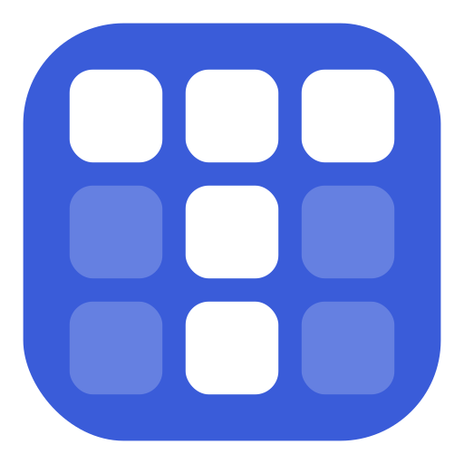

<p align="center">
  
</p>

<h1 align="center">Tabula</h1>

<p align="center">
  <strong>Il tuo diario di lavoro.</strong> Una PWA locale per tracciare la giornata
  lavorativa — ore su clienti e progetti, attività interne, todo e presenze —
  con frizione zero e tutti i dati sul tuo dispositivo.
</p>

<p align="center">
  
  
  
  
  
  
</p>

---

## Cos'è

**Tabula** è una *Progressive Web App* pensata per un singolo professionista che
traccia la propria giornata di lavoro: cosa ha fatto, su quale cliente o progetto,
quanto tempo, e cosa deve ancora fare.

Funziona come un **calendario** (giorno / settimana / mese) fatto di blocchi-evento,
affiancato da viste di sintesi. È pensata per stare **sempre aperta di lato**: apri,
annoti, chiudi — e a fine periodo ricavi numeri affidabili senza lavoro manuale.

Non c'è backend, non c'è login, non c'è telemetria: **i dati restano nel browser**
(IndexedDB) e sono solo tuoi. Installabile come app e utilizzabile offline.

> La filosofia: lo strumento sta sullo sfondo, il contenuto — il tuo tempo — è il
> protagonista. Calma, precisa, personale: la voce di un buon quaderno, non di
> un'app SaaS.

## Funzionalità

### 📅 Calendario

- **Tre viste** — Giorno, Settimana, Mese — con navigazione rapida (precedente /
  oggi / successivo) e annulla/ripeti delle modifiche.
- **Blocchi-evento** creabili e spostabili con un gesto: trascina per creare,
  sposta e ridimensiona sulla griglia oraria con snapping a 15 o 30 minuti.
- **Copia / incolla dei blocchi** — `⌘C`/`⌘V` (o tasto destro sulla griglia →
  «Incolla qui», più il bottone *Incolla* nel pannello giornata): riporta
  un'attività su un altro giorno/orario conservandone classificazione e contenuti,
  con annulla immediato. Esiste anche **Duplica** (stesso giorno, primo slot libero).
- **Linea "ora corrente"** in stile calendario, aggiornata al minuto.
- **Vista Mese con sidebar di riepilogo**: la griglia mensile affiancata da ore,
  copertura, presenze e ripartizione per cliente; passando o cliccando su un
  cliente/tipo nella sidebar, i giorni corrispondenti spiccano nella griglia.
- **Quattro tipi di voce**: lavoro su *cliente*, attività *interna*, *ferie*,
  *evento*. Ogni blocco porta titolo, note (Markdown), blocchi/problemi incontrati,
  prossimi passi, collaboratori, contatti, link e milestone.
- **Shell ad altezza fissa**: la giornata lavorativa sta tutta a video, senza scroll.

### 🗂️ Clienti & Progetti

- Organizza il lavoro per **cliente → progetto → sottotipo**, con cascata di
  selezione e ultimo-usato memorizzato per velocizzare l'inserimento.
- Schede progetto complete: stato (attivo / completato / in pausa / archiviato),
  descrizione, obiettivi, date, team, contatti, ore stimate e sotto-attività.
- **Colore per cliente/sottotipo** sui blocchi del calendario (barra + wash), con
  fallback deterministico — sempre accompagnato dal titolo, mai solo colore.
- **Statistiche di progetto**: ore consuntivate vs. stimate e andamento.

### ✅ Todo

- Lista di cose da fare con **sotto-attività**, tag, scadenza e collegamento a un
  progetto.

### ⏱️ Timer

- **Timer "in corso"** con un click: avvii, lavori, e allo stop diventa una voce
  del calendario — senza sporcare la griglia mentre gira.

### 🏢 Presenze

- Traccia la **sede del giorno** (da remoto / ufficio / cliente) e monitora il
  rispetto di obiettivi percentuali (es. % minima in ufficio o dal cliente).

### 📊 Riepilogo

- Sintesi del mese: **ore totali** e media, **giorni compilati** (copertura della
  giornata lavorativa) con ore registrate vs. attese, **presenze** rispetto agli
  obiettivi, e ripartizione **per cliente** con scomposizione per sottotipo.
- Disponibile sia come **sidebar della vista Mese** (con evidenziazione della
  griglia) sia come **pagina dedicata** a tutta larghezza.

### 🔍 Ricerca

- Ricerca trasversale su voci, progetti e todo.

### ⚙️ Impostazioni

Organizzate per sezioni:

- **Generale** — tema chiaro / scuro / sistema, vista predefinita, granularità slot.
- **Orari** — fasce mattino/pomeriggio, giorni lavorativi, giorno del patrono.
- **Categorie** — sottotipi e colori per clienti e attività interne.
- **Presenze** — abilitazione e obiettivi percentuali per sede.
- **Dati** — import/export.

### 🔒 Privacy & dati locali

- **Nessun backend, nessun account, nessuna telemetria.** Tutto è salvato in
  IndexedDB sul tuo dispositivo.
- **Import / export** dei dati per backup o migrazione.
- **PWA installabile e offline-first**: nessuna dipendenza di rete a runtime
  (icone inline, font di sistema).

### ♿ Accessibilità

- Target **WCAG 2.1 AA**: contrasti adeguati, focus visibile, navigazione completa
  da tastiera.
- Tema chiaro / scuro / sistema; il colore non è mai l'unico veicolo di significato.
- Rispetto di `prefers-reduced-motion`.

## Stack tecnologico

| Ambito        | Tecnologia |
|---------------|------------|
| UI            | React 18 + TypeScript |
| Build         | Vite 6 |
| Stile         | Tailwind CSS 3 (token OKLCH) |
| Stato         | Zustand |
| Storage       | IndexedDB via Dexie |
| Ricorrenze    | rrule |
| Markdown      | react-markdown + remark-gfm |
| Test          | Vitest + Testing Library |

## Avvio rapido

Prerequisiti: **Node.js 18+** e npm.

```bash
git clone <repo-url>
cd Tabula/app
npm install
npm run dev        # http://localhost:5173
```

### Script disponibili (da `app/`)

```bash
npm run dev        # dev server
npm run build      # build di produzione
npm run preview    # anteprima della build
npm test           # suite di test (Vitest)
npm run coverage   # test + coverage
npm run typecheck  # type-check (tsc -b)
```

## Struttura del progetto

```
app/src/
├── data/        storage (IndexedDB/Dexie), modello dati, import/export
├── domain/      logica pura (nessun I/O, nessun React) — test-driven
├── store/       stato applicativo (Zustand)
├── features/    UI per dominio (calendar, projects, todo, summary,
│                presenze/settings, search, layout)
├── ui/          primitivi UI (Button, Modal, Popover, Combobox, …)
└── styles/      token di design e configurazione Tailwind
```

## Metodo di sviluppo

Sviluppo **test-driven** (red → green → refactor): il test precede
l'implementazione. La logica di `domain` / `data` / `store` non entra senza un
test scritto prima.

Per il prodotto e il sistema visivo, vedi [`PRODUCT.md`](PRODUCT.md) e
[`DESIGN.md`](DESIGN.md).

## Licenza

Progetto personale. Tutti i diritti riservati salvo diversa indicazione.
